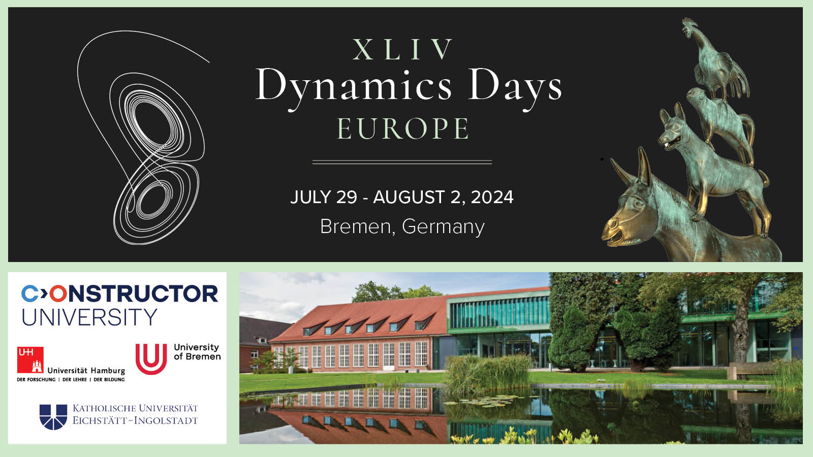

XLIV Dynamics Days Europe
=========================

Bremen, July 29 - August 2, 2024
--------------------------------

[**Dynamics Days Europe**](https://dynamicsdays.eu/) is a series of major international conferences founded in the 1980's that provides a European forum for developments in the theory and applications of dynamics. For more than 40 years, it has been bringing together researchers from a wide range of backgrounds including physics, mathematics, biology, and engineering for interdisciplinary research in nonlinear science.

###  Registration is now open

* See [detailed instructions and conditions](Registration)
* Direct link to the [registration web site](https://express.converia.de/frontend/index.php?folder_id=8423) operated by Converia
* Any other offers for accomodation are not by us and may be a scam!
* **Upcoming early bird registration deadline: April 30, 2024**
* **Late submission deadline for minisymposium abstracts and contributed posters: April 30, 2024**

### Conference Topics

*    Ergodic theory, topological and homogeneous dynamics
*    Network dynamics
*    Machine Learning
*    Bifurcation theory
*    Dynamics and geometry
*    Nonlinear waves
*    Fluids and turbulence
*    Computational methods
*    Medical and neuro-dynamics
*    Quantum Chaos
*    Multibody dynamics
*    _and more_

### Dates and Deadlines

* Deadline for submitting abstracts for minisymposium talks and
  posters: April 30, 2024
* Early bird registration deadline: April 30, 2024
* Late registration deadline: June 30, 2024

### Stay informed

*    Subscribe to the general [Dynamics Days Europe mailing list](https://onsager.ugr.es/mailman3/mailman3/lists/dynamics_days.onsager.ugr.es/)
*    Subscribe to the [Bremen 2024 mailing list](https://mailman.zfn.uni-bremen.de/cgi-bin/mailman/listinfo/ddays2024bremen)

Initial calls for participation will go via both lists, Bremen-specific details only via the second.

### Sponsoring

We gratefully acknowledge financial support from

* The Wilhelm and Else Heraeus Foundation
  
  

* The DFG (German Research Foundation)
  
  

* The Wolfgang-Ritter Foundation

For sponsors: Please see our [Sponsoring Flyer](flyer_dynamics_days_2024_sponsoring.pdf) for more information.

### Contact

*    [bremen2024@dynamicsdays.eu](mailto:bremen2024@dynamicsdays.eu)

 

