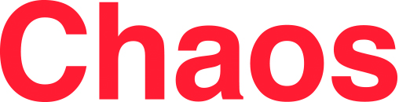

XLIV Dynamics Days Europe
=========================

Bremen, July 29 - August 2, 2024
--------------------------------

[**Dynamics Days Europe**](https://dynamicsdays.eu/) is a series of major international conferences founded in the 1980's that provides a European forum for developments in the theory and applications of dynamics. For more than 40 years, it has been bringing together researchers from a wide range of backgrounds including physics, mathematics, biology, and engineering for interdisciplinary research in nonlinear science.

### News

* [Program overview](Program/Time_Slots_Final.pdf)
* [Detailed schedule (tentative)](https://express.converia.de/frontend/index.php?page_id=37679)
* [List of all contributions](Program/Contributions/)
* Updated [local information](Location/Local_Information) now available!
* Welcome reception on Sunday, July 28, from 18:00 in front of the Campus Center (IRC)

### Conference Topics

*    Ergodic theory, topological and homogeneous dynamics
*    Network dynamics
*    Machine Learning
*    Bifurcation theory
*    Dynamics and geometry
*    Nonlinear waves
*    Fluids and turbulence
*    Computational methods
*    Medical and neuro-dynamics
*    Quantum Chaos
*    Multibody dynamics
*    _and more_

### Stay Informed

*    Subscribe to the general [Dynamics Days Europe mailing list](https://onsager.ugr.es/mailman3/mailman3/lists/dynamics_days.onsager.ugr.es/)
*    Subscribe to the [Bremen 2024 mailing list](https://mailman.zfn.uni-bremen.de/cgi-bin/mailman/listinfo/ddays2024bremen)

Initial calls for participation will go via both lists, Bremen-specific details only via the second.

### Sponsoring

We gratefully acknowledge financial support from

* [DFG (German Research Foundation)](https://www.dfg.de/en)
  
  

* [Springer](https://www.springer.com/de)
  
  

* [Wilhelm and Else Heraeus Foundation](https://www.we-heraeus-stiftung.de/english/)
  
  

* Wolfgang-Ritter Foundation

The four poster awards are sponsored by AIP's journals

* [Chaos](https://pubs.aip.org/aip/cha?utm_source=SPONSORSHIP&utm_medium=logo&utm_campaign=CHA_DYNAMIC_DAYS_EUROPE_2024&utm_id=CHA_DYNAMIC_DAYS_EUROPE_2024)
  
  

* [Journal of Mathematical Physics](https://pubs.aip.org/aip/jmp?utm_source=SPONSORSHIP&utm_medium=logo&utm_campaign=JMP_DYNAMIC_DAYS_EUROPE_2024&utm_id=JMP_DYNAMIC_DAYS_EUROPE_2024)
  
  

An additional book voucher poster award is sponsored by

* [Cambridge University Press](https://www.cambridge.org/)
  
  

For sponsors: Please see our [Sponsoring Flyer](flyer_dynamics_days_2024_sponsoring.pdf) for more information.

### Contact

*    [bremen2024@dynamicsdays.eu](mailto:bremen2024@dynamicsdays.eu)

 

Feel free to share our poster:

 
<a href="DynamicsDaysPoster.pdf">

